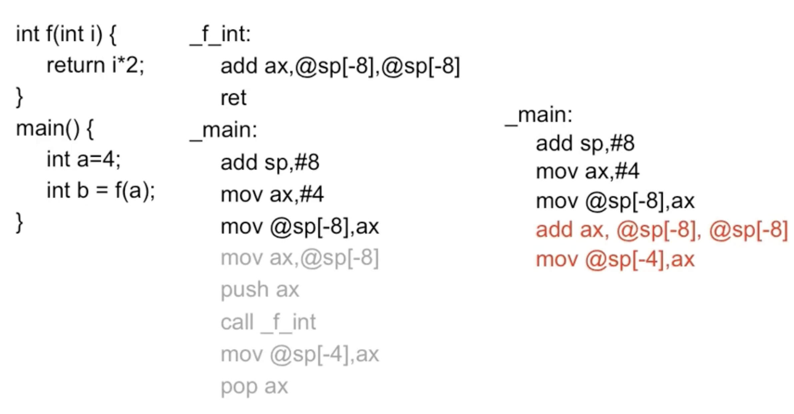

## 第五章 函数

### inline 函数

将函数声明为inline可以避免函数调用的开销，空间换时间

调用函数步骤：

1. 返回地址压栈
2. 函数参数压栈
3. 计算返回值
4. 函数部分所有元素出栈，返回值

普通函数与inline函数的汇编代码对比

**inline函数不是定义是声明，应该写在头文件里，保证编译器将其作为inline函数展开**

宏定义与inline函数的区别

|          | 宏定义                               | inline函数                                               |
| -------- | ------------------------------------ | -------------------------------------------------------- |
| 类型检查 | 无                                   | 有                                                       |
| 实现方式 | 预处理时展开                         | 由编译器实现展开，是否将函数作为inline依赖于编译器的判断 |
| 其他     | 容易引发运算符优先级的问题，不可调试 | 可以调试                                                 |

