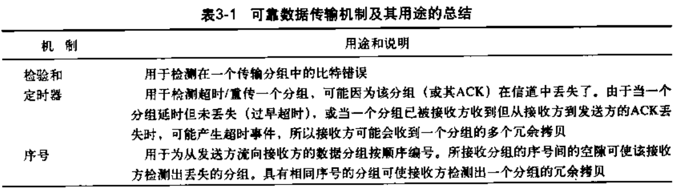
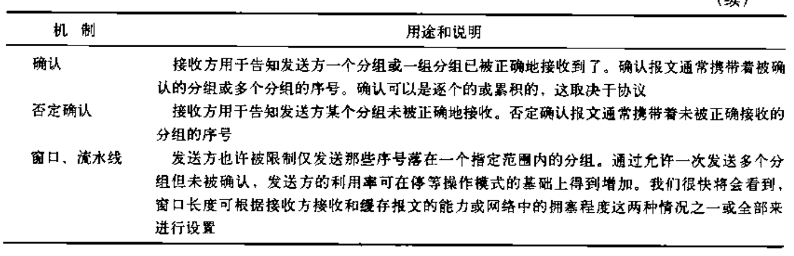
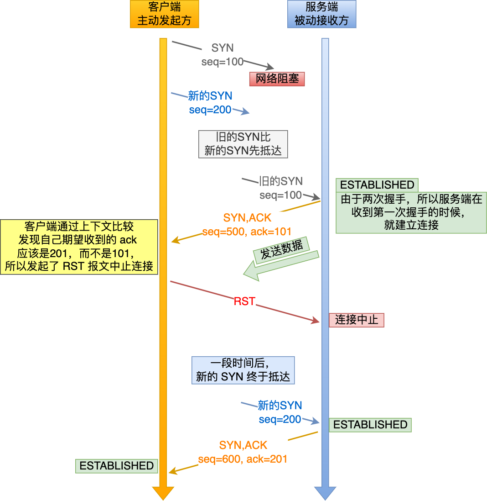
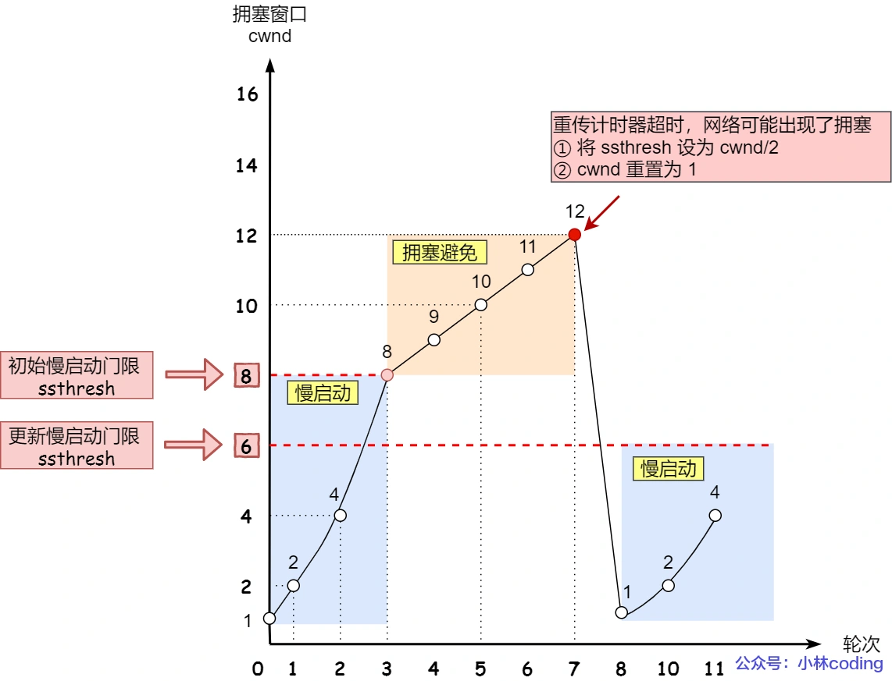
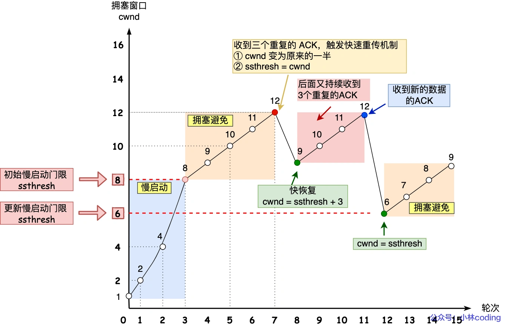

## 第三章 传输层

### 概述和传输层服务

可靠的、保序的传输：TCP

- 多路复用，解复用
- 拥塞控制
- 流量控制（防止接收方缓存区满造成的分组丢失）
- 建立连接

不可靠、不保序的传输：UDP

- 多路复用，解复用
- 没有为尽力而为的IP服务添加更多的其他服务

都不提供的服务：

- 延时保证
- 带宽保证

### 可靠数据传输原理

#### RDT协议（递进关系）

1. rdt1.0：不提供反馈信息（假设所有数据包都正确从发送端传送到接收端）

2. rdt2.0：**停止等待协议**，引入差错检验，接收方反馈，重传机制。接收方在检验后向发送方返回ACK（正确）/NCK（错误），这里的重传是对于NCK的重传，没有考虑对于丢失处理的超时重传（假设所有反馈消息都能正确送到发送端，没有消息分组的丢弃）
3. rdt2.1：ACK/NCK对于接受到的效益编号，由于为停止等待协议，发送方若未收到消息的确认则不发下个消息，所以只需要一个位表示序号0/1
4. rdt2.2：通过对于上个消息序号的确认替代对于本次消息的NCK（基于rdt2.1的小升级）
5. rdt3.0：引入超时重传机制，可能在接收端会出现冗余分组，但rdt2.2已可以应对（应对消息分组的丢失，但由于为停止等待，网络利用率很低）

##### 回退N步（GBN）协议

基于发送方的**滑动窗口**实现，允许发送方发送多个分组而不需要等待确认，但它也受限于流水线中未取人的分组书不能超过最大允许数N（**流量控制**，防止因接收方缓存空间不足引发的包丢弃）。

接收方只按序接收分组（假设为k），一次交付给上层一个分组，对于所有大于k的分组丢弃，即只维护一个待接收分组序号的变量

发送方采取**累计确认**，即对于k的ACK确保小于等于k的分组已被接受

缺点：接收方丢弃正确但失序的分组，存在**冗余重传**的问题

##### 选择重传（SR）协议

发送方只对于超时或者错误的分组重传，通过接收方维护一个滑动窗口实现

对于发送方的冗余分组，发送方必须给出该分组的ACK，否则发送方滑动窗口始终无法前进

对于SR协议，窗口长度必须小于等于序号空间大小的一半

#### 可靠数据传输的机制

### 面向连接的TCP协议

序号：当前分组编号

确认号：希望收到的下个分组的序号

发送方采取**累计确认**，接收方对于失序分组丢弃或者缓存（TCP未规定）

对于发送多个分组，如果超时，发送方只发送最早的未确认分组

**快速重传**：接收方收到三个对于同样序号k的ACK，则立即发送k分组，不再等到超时

**流量控制**：接收方把缓存区余量发送给接收方，便于接收方控制发送速率（捎带）

**三次握手**：

TCP 建立连接时，通过三次握手**能防止历史连接的建立，能减少双方不必要的资源开销，能帮助双方同步初始化序列号**。序列号能够保证数据包不重复、不丢弃和按序传输。

不使用「两次握手」和「四次握手」的原因：

- 「两次握手」：无法防止历史连接的建立，会造成双方资源的浪费，也无法可靠的同步双方序列号；
- 「四次握手」：三次握手就已经理论上最少可靠连接建立，所以不需要使用更多的通信次数。

两次握手的问题（无法防止历史连接）：

如果为两次握手

TCP连接释放四次握手（其实是没法做到完备的）

**拥塞控制**：调整发送速率处理网络内部拥塞的问题

对于超时的拥塞控制机制（严重）

对于三个冗余ACK的拥塞控制机制（不严重）

快速恢复算法过程中，为什么收到新的数据后，cwnd 设置回了 ssthresh ？

1. 在快速恢复的过程中，首先 ssthresh = cwnd/2，然后 cwnd = ssthresh + 3，表示网络可能出现了阻塞，所以需要减小 cwnd 以避免，加 3 代表快速重传时已经确认接收到了 3 个重复的数据包；
2. 随后继续重传丢失的数据包，如果再收到重复的 ACK，那么 cwnd 增加 1。加 1 代表每个收到的重复的 ACK 包，都已经离开了网络。这个过程的目的是尽快将丢失的数据包发给目标。
3. 如果收到新数据的 ACK 后，把 cwnd 设置为第一步中的 ssthresh 的值，恢复过程结束。

**首先，快速恢复是拥塞发生后慢启动的优化，其首要目的仍然是降低 cwnd 来减缓拥塞，所以必然会出现 cwnd 从大到小的改变。**

**其次，过程2（cwnd逐渐加1）的存在是为了尽快将丢失的数据包发给目标，从而解决拥塞的根本问题（三次相同的 ACK 导致的快速重传），所以这一过程中 cwnd 反而是逐渐增大的。**
