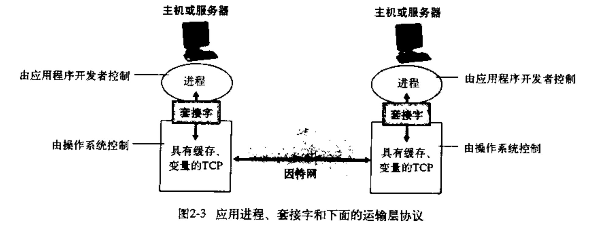
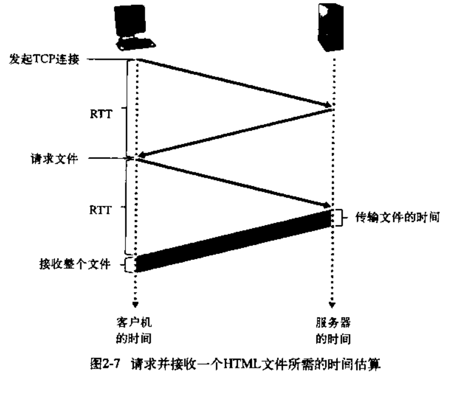
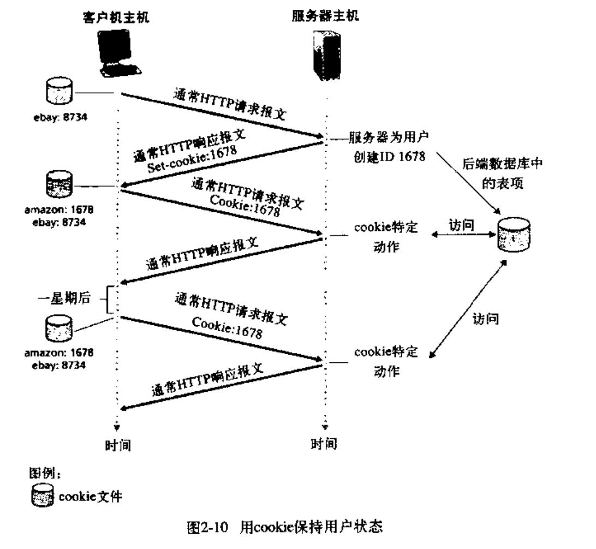
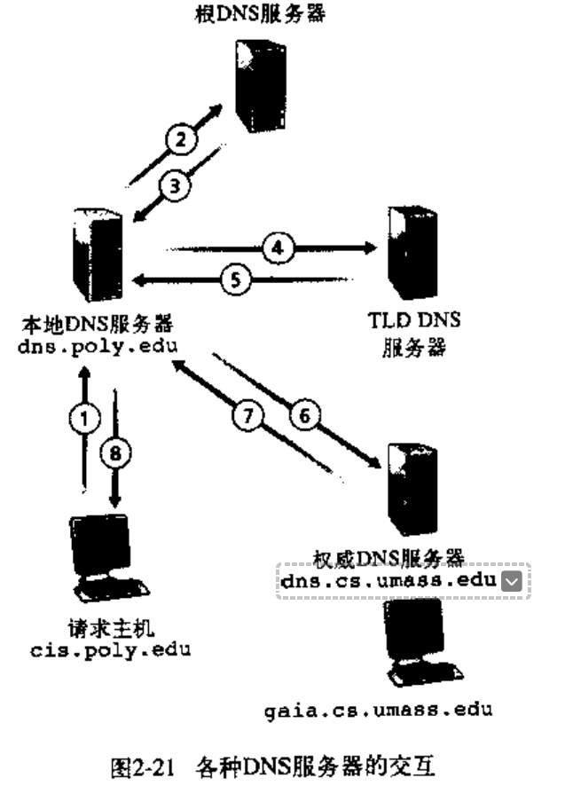

## Chapter 2: 层

### 应用层协议原理

传输层向应用层提供的服务为socket API

#### socket

简化本主机应用层向传输层发送的非有效信息，通过socket代表一组信息

TCP socket包含源IP，源端口，目标IP，目标端口，连接状态

UDP socket包含源IP，源端口

但是传输报文时必须提供对方IP，port。接收报文时传输层需要上传对方的IP，port

### Web和HTTP

http为无状态协议，状态通过cookies实现

#### DNS

IP到域名的转换，运行在UDP上

### 其他协议

FTP：文件传输协议

SMTP：简单邮件传输协议（发送）
