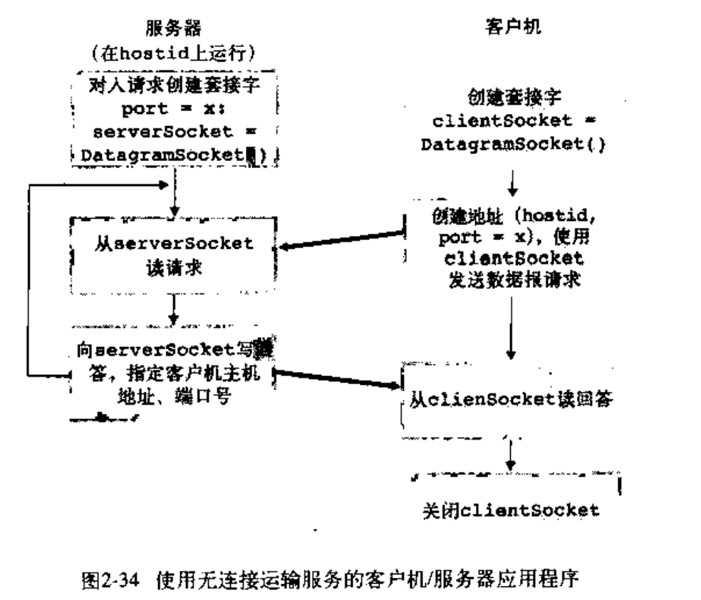
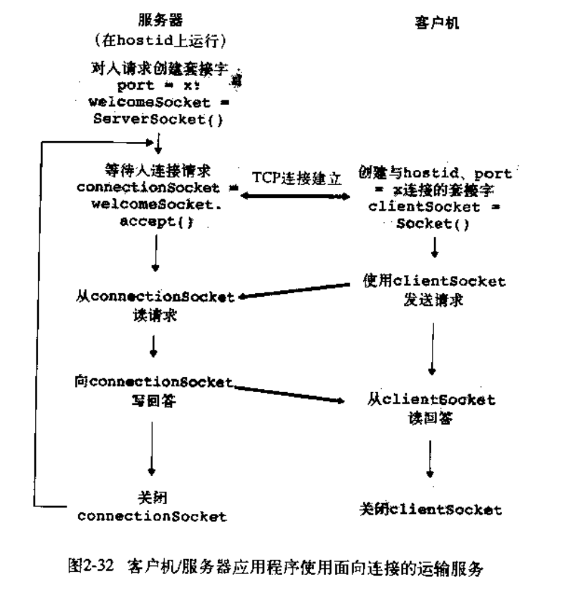

## 第二章 应用层（网络编程）

### UDP编程



UdpClient

```python
from socket import *
serverName = "hostname"
severPort = 12000
clientSocket = socket(AF_INET,SOCK_DGRAM) # ipv4,udp
message = "Hello World"
clientSocket.sendto(message.encode(),(serverName,severPort))
modifiedMessage,serverAddress = clientSocket.recvfrom(2048)
print(modifiedMessage.decode)
clientSocket.close()
```

Udpserver

```py
from socket import *
serverPort = 12000
serverSocket = socket(AF_INET, SOCK_DGRAM)  # ipv4,udp
serverSocket.bind(('', serverPort))
print("The server is ready to receive")
while True:
    message, clientAddress = serverSocket.recvfrom(2048)
    modifiedMssage = message.decode().upper()
    serverSocket.sendto(modifiedMssage.encode(), clientAddress)
```

#### TCP编程



TcpClient

```py
from socket import *
serverName = "servername"
serverPort = 12000
clientSocket = socket(AF_INET,SOCK_STREAM) #ipv4,tcp
clientSocket.connect((serverName,serverPort))
sentence = "Hello World"
clientSocket.send(sentence.encode()) # tcp three-way handshake to welcomesocket
modifiedSentence = clientSocket.recv(1024)
clientSocket.close()
```

TcpServer

```python
from socket import *
serverPort = 12000
welcomeSocket = socket(AF_INET,SOCK_STREAM) # create for client to handshake
welcomeSocket.bind(('',serverPort))
welcomeSocket.listen(1) # accept one connection
print("The server is ready to receive")
while True:
    connectionSocket,addr = welcomeSocket.accept() # create socket to connect to client
    sentence = connectionSocket.recv(1024).decode()
    modifiedMssage = sentence.decode().upper()
    connectionSocket.send(modifiedMssage.encode())
    connectionSocket.close()
```

### 区别

TCP需要在传输前建立连接，传输后关闭连接
