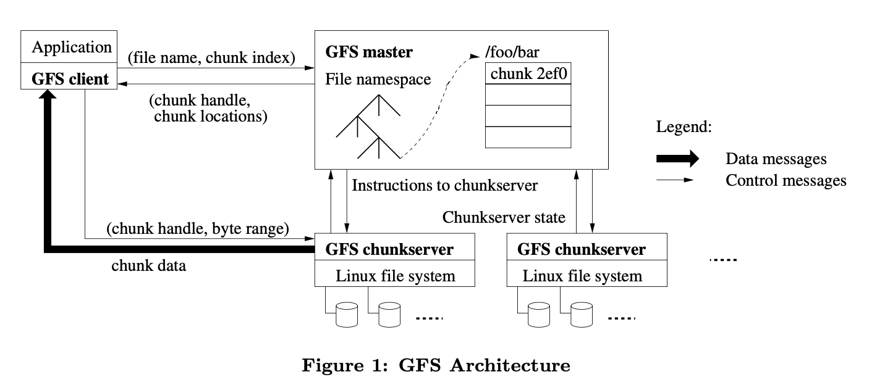
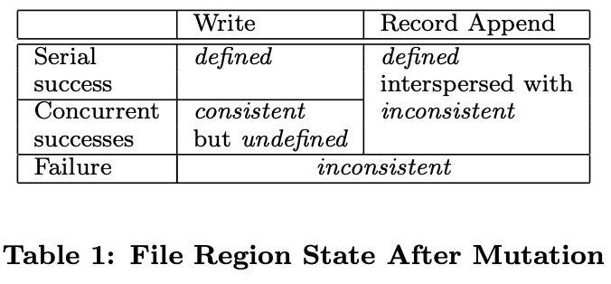
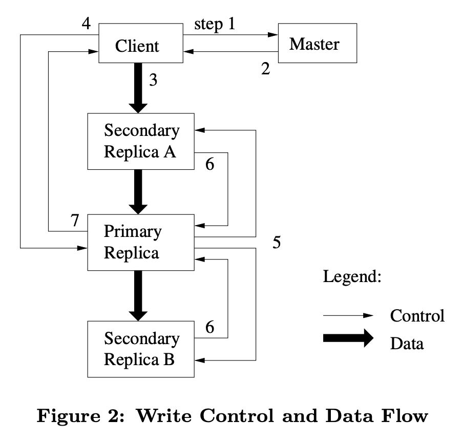

### Chapter2 GFS

#### 摘要

GFS是一个可以支持上千个机器和硬盘，上百用户同时访问的文件系统

#### 介绍

| 问题或现象                          | 解决办法                               |
| ----------------------------------- | -------------------------------------- |
| 机器错误                            | 持续监控，错误发现，错误处理，自动恢复 |
| 文件过大                            | 设计IO操作和block大小                  |
| 大部分文件写为append而不是overwrite | 只优化append保证性能和原子性           |
| 引入GFS特有文件读写方式             | 复用部分文件系统API                    |

#### 设计概述

##### 假设

- 系统通过廉价机器组成
- 日常处理GB级的文件
- 写大部分为append
- 多个用户看到的同一个文件必须相同
- 保证高频使用的准确性

##### 接口

GFS**不使用类似于POSIX的标准API**

#### 架构

**chunk：**文件被分成**固定大小**的chunks。Chunkserver在本地磁盘保存chunks，通过chunk handle读写字节范围的chunk data

**master：**master节点维护所有文件系统的**元数据**，包括namespace，可用的控制信息，文件到chunks的map-ping，当前所有chunks的存储位置。另外还控制系统级别的事件，比如chunk租约管理，孤立chunks的垃圾回收，chunkserver间的chunk迁移。master还会周期性地与chunkserver通信heartbeat信息，给它指令和收集信息

**client：**GFS client节点链接所有应用实现文件系统API，代表应用程序**与master和chunkserver通信**。client只和masrer交换元数据，所有data通过直接与chunkserver通信拿到。client和chunkserver都不缓存文件data

#### 通信步骤（介绍GFS读方法）

client不从master节点读写data，而是询问master哪个chunkserver可以访问，然后在一段时间内**缓存**该信息，之后直接与chunkserver通信

通信步骤如下：

1. client将应用程序给的（file name，byte offset）转化为chunk index（offset/chunk_size）
2. client将（file name，chunk index）传给master
3. master返回（chunk handle，chunk对应的所有备份文件的localtions）
4. client缓存这些信息，通过（file name，chunk index）和chunk handle的map记录
5. client优先向离自己最近的含有需要chunk的chunkserver请求（chunk handle，byte range），通常是请求所有的包含需要chunk的服务器
6. chunkserver返回client（chunk data）

除非client的缓存信息过期或者文件被其他client打开，client不会访问master

由于读最近的server，所以**data未必是最新的**

#### Chunk大小

chunk大小为64MB，选取这么大的优点是

- 减少client和master的通信次数
- 减少client和master的TCP通信的overhead
- 减少master存储的元数据的大小

缺点是

- 如果原始data很小而且client一直访问它，会造成同一个chunk的高频访问

#### 元数据

master保存了三种主要的元数据

- file和chunk的namespace（NV）
- file到chunks的映射（NV）
- 每个chunk副本的位置（V）

所有元数据都存在master的内存中，前两个也存在持久化的log中，而且有远程的备份。对于第三个，master不使用持久化存储，因为master可以在启动后询问所有chunkserver它保存的chunk

##### 在内存中的数据结构

对于内存中元数据的周期性扫描可以实现

- chunk垃圾回收
- 在chunkserver出错时重新复制
- 为了平衡chunkservers中硬盘使用负载而需要的chunk迁移

##### chunk位置

master**从不持久化记录**哪几个chunkserver有特定chunk的副本，而是在启动时询问chunkserver这些信息

不进行持久化保存**减少了master和chunkserver间的一些同步问题**，比如chunkserver的退出和加入，名字的变化，失败和重启等等

##### 操作日志

操作日志记录了每次重要的元数据变化，它不仅是元数据的持久化记录还规定了同步操作的顺序。只有在本地和远程的操作日志都更新后才进行具体操作。

使用checkpoint可以减少日志的大小，有问题时只需要从最近的checkpoint恢复即可

master 会在本地磁盘存储 log，而不是存到数据库，原因是：数据库的本质是某种 B 树或者 hash table，而相比之下追加 log 会更加高效；而且，通过在 log 中创建一些 checkpoint 点，重建状态也会更快

#### 一致性模型

##### 通过GFS保证

**file namespace**的变化是原子的。通过master里的namespace锁保证

如果文件状态是consistent，则所有client看到的同个文件多个副本的data都是相同的，文件状态如下图

concurrent success表示所有client能看到相同的data但是不代表所有修改都被写入

应用程序可以区分undefined状态

GFS通过对于某个chunk及其所有副本以**相同顺序写入**来保证data是准确的，通过**chunk version**来标识写入的情况。过时的副本将不会参加接下来的变化或者被master将位置传给client，它将在之后以高优先级被回收

由于client缓存chunk位置，所以它**可能会读到过时的chunk**。这种情况无法避免，只能**通过缓存时间失效并重新向master访问减少**

GFS通过**定期向chunkserver握手**，通过**checksumming**来检查问题。一旦有问题，data将尽早通过其他副本恢复。只有当所有副本都有问题时该data才会出错，应用程序会收到明确的错误信息而不是错误的data

##### 对应用程序的影响

writer的所有record包含checksum等额外信息，来确保有效性

reader能够通过checksum来删除额外信息，找到data

##### 租约机制和修改顺序

master会将chunk的lease（租约）授权给其中一个副本，称为primary，它可以规定修改的顺序，所有副本必须遵循primary的修改顺序

lease的timeout默认为60秒。然而只要chunk正在被改变，primary可以通过heartbeat message向master请求延长timeout。另外master也可以提前重新分配primary。

即使master断开了与primary的通信，只需要等待timeout后重新分配primary即可

#### GFS写方法

1. client向master询问要写部分对应的chunk和chunkserver的信息，并知道其中哪个是primary
2. master返回chunk handle，chunkserver，primary chunkserver。client将信息缓存在本地。只有缓存信息过期才会去询问master
3. client将信息传给所有拥有副本的chunkserver
4. client发写指令给primary
5. primary以自己规定的顺序写，secondary和primary写的顺序保持一致
6. secondary写完后将信息同步给primary
7. primary告知client已写完或某步失败

对于第一步，master可能不知道谁是primary，它会把version和所有拥有副本的chunkserver比较，过段时间后（使前一个lease过期，防止同时出现两个primary），取最新的version作为primary。master维护的version可能也不是最新的，如果落后也会更新到最新版本

#### GFS的局限

GFS 是**宽松的一致性模型**(relaxed consistency model)，可以理解是弱一致性的，它并**不保证一个 chunk 的所有副本是相同的**

**GFS 最严重的局限性就在于它只有一个 master 节点**(这篇文章讨论了这个问题：https://queue.acm.org/detail.cfm?id=1594206)， 单个 master 会带来以下问题：

- 随着 GFS 的应用越来越多，文件也越来越多，最后 master 会耗尽内存来存储 metadata；你可以增加内存，但单台计算机的内存始终有上限；
- master 节点要承载数千个 client 的请求，master 节点的 CPU 每秒只能处理数百个请求，尤其是还要将部分数据写入磁盘——client 的数量会超过单个 master 的能力；
- 弱一致性会导致应用程序很难处理 GFS 奇怪的语义；
- 最后一个问题，master 的故障切换不是自动的，需要人工干预来处理已经永久故障的 master 节点，并更换新的服务器，这需要几十分钟甚至更长的时间来处理。对于某些应用程序来说，这个时间太长了。