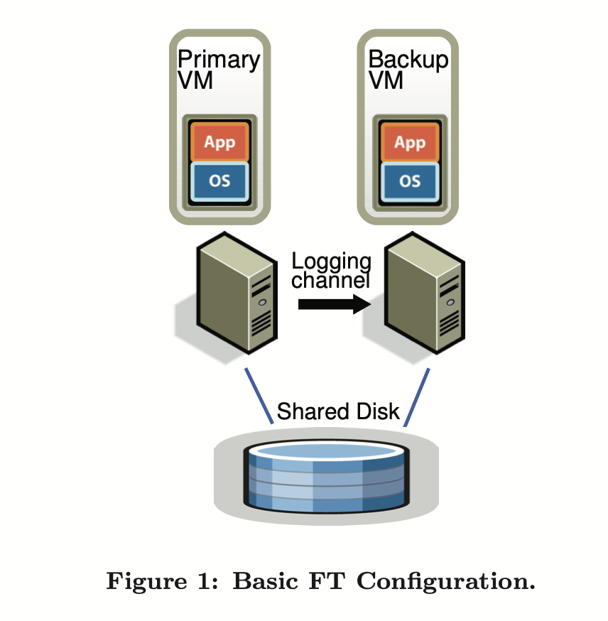
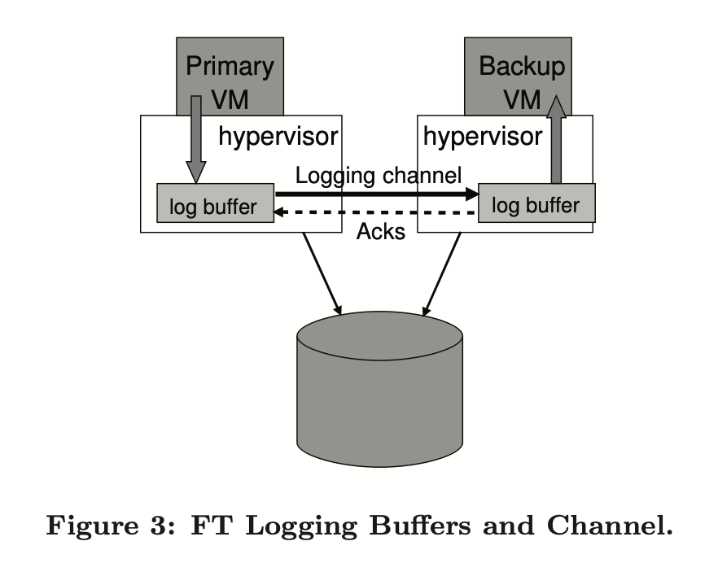

### Chapter3 VMwareFT

#### 状态转移和复制状态机

状态转移（State Transfer）：Primary将自己的完整状态（例如内存中的内容），拷贝发给Backup

复制状态机（Replicated State Machine）：将来自客户端的操作或其他外部事件，从Primary传到Backup。由于**外部操作比服务的状态要小得多**，所以大多采用该方法，缺点是同步会比较复杂

#### 架构

**主虚拟机(Primary VM)简称为主机，Backup VM 简称为备机**。

VMware FT 需要两台物理服务器，主机与备机保持同步，虚拟机的虚拟磁盘在共享存储上。

所有的输入(如网络、鼠标、键盘等)都会输入到主机，然后通过 Logging channel 转发到备机，对于非确定性的操作，还将发送额外的信息，确保备机以确定性的方式执行这些操作。

两台虚拟机都会执行输入操作，但**只有主机的输出会返回客户端，备机的输出会被管理程序丢弃**。

#### 非确定性事件

非确定性事件：Primary和Backup执行会有不同的结果

| 事件        | 具体情况               | 解决方案                                   |
| ----------- | ---------------------- | ------------------------------------------ |
| 客户端输入  |                        | 通过log 确保网络数据包的内容，中断时间相同 |
| 怪异指令    | 随机数生成，时间获取等 | Primary直接将结果传给Backup                |
| 多CPU的并发 | 不同的核做了不同的处理 | 论文没提到                                 |

对于不确定性输入，必须记录足够的信息来重放，*但是论文中没有描述具体的日志格式*，可能有三种记录：

- 事件发生时的指令序号；
- 日志类型。可能是普通的网络数据输入，也可能是怪异的指令；
- 数据

#### 输出控制

VMware FT 通过确定性重放来产生相关的日志条目，但不将日志写入磁盘，而是通过 logging channel 发送给备机。备机实时重放日志项。

为了容错，必须在 loggin channel 上实现严格的容错协议，有以下要求：

**输出要求**：如果备机在主机故障后接管，备机将以和主机已经向外界发送的输出完全一致的方式继续运行。

最简单的方式是对每一个输出操作创建一个特殊的日志项。

但有一种情况，假设虚拟机运行的是数据库，主机备机的数据都是 10。现在客户端发送自增请求，主机做了 `+1` 并回复给客户端 11，之后马上宕机了，更糟糕的是主机发送给备机的 `+1` 操作也丢包了。这时候备机还是 10，并接管了主机的工作，客户端再次请求 `+1`，又会收到 11 的回复。客户端会得到一个怪异的结果（自增两次还是 11）。

所以要求：

**输出规则：主机直到备机接收并确认了和输出相关的日志的时候，才发送输出给外界。**

这样做的目的是，只要备机收到了所有的日志条目，即使主机宕机了，备机仍能够重放到客户端最后看到的状态。

向外界的输出会被延迟，直到主机收到来自备机的确认。**在Backup接管后需要把log buffer内的指令全部运行完才响应客户端的新请求。**

**几乎每一个复制系统都有这个问题：在某个时间点，主机必须停下来等待备机，这肯定会限制性能。**

> 注意：因为没有两阶段提交事务，不能保证所有的输出只被生成一次。**备机无法判断主机是在宕机之前还是之后发送了最后的输出，备机可能会重新执行一次输出操作**。不过，VMware 通过其网络基础设施来检测重复数据包，并防止输出重传到客户端。

#### 发现与处理故障

主机和备机必须快速知道另一方故障，通过 **udp 心跳包**和**监控 logging channel 上的流量**相结合来检测，如果心跳超时或 logging channel 流量停止则表明故障。

如果备机故障，主机就会停止向 logging channel 发送日志，继续正常运行。

> 在这之后备机怎么追上主机呢？VMware有一个工具叫 VMotion，它能够在最小程度上中断虚拟机的执行，克隆一个虚拟机。

如果主机故障，备机必须先重放，直到消耗完最后一个日志项。然后备机接替主机，开始向客户端生产输出。

为了确保一次只有一个虚拟机成为主机，避免出现脑裂，VMware 在共享存储上执行一个原子的 `test-and-set` 锁指令。该操作每次只能对其中一台机器返回成功，这在主机和备机因为网络分区都想接替工作时很有用。但如果共享存储因为网络问题不能访问，那么无论如何都不能正常工作。

当其中一台虚拟机发生故障时，VMware FT 会在另一台物理机上自动启动新的备份虚拟机来恢复冗余。

#### 参考

[【MIT 6.824】学习笔记4: 主从复制(Primary/Backup Replication)](https://mp.weixin.qq.com/s?__biz=MzIwODA2NjIxOA==&mid=2247484239&idx=1&sn=27c7430f51e88628874ef1514cb6c152&chksm=9709808aa07e099c3d49637b05d62bf951ea48fa8e0c74b0d02f4af32e75569ea1bc535403ac&cur_album_id=1751707148520112128&scene=189#wechat_redirect)