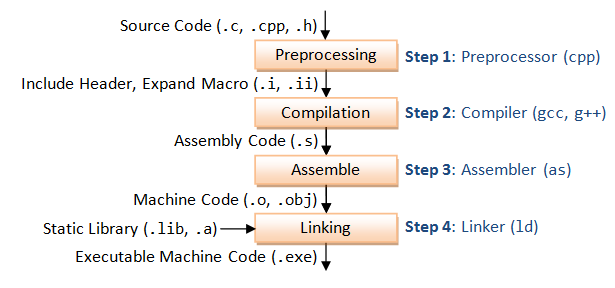

## 第一章 开始


1. `endl`将于设备关联的**缓冲区（buffer）**中的内容刷到设备中。在调试时应保证"一直"刷新流。否则若程序崩溃，输出可能还是缓冲区，导致对于程序崩溃位置的错误推断

2. 读取数量不定的输入数据可用`while (std::in >> value)`

   当遇到**文件结束符（end-of-file）**，或遇到一个无效输入时，*istream*对象状态变为无效，使条件为假

   EOF：在Windows中为`Ctrl+Z`，UNIX为`Ctrl+D`


### C++编译过程

1. 预处理(Preprocessing)

   将所有的#include**头文件以及宏定义替换成其真正的内容**，预处理之后得到的仍然是文本文件，但文件体积会大很多。gcc的预处理是**预处理器cpp来完成的**。（include只做文本插入，在include的位置将头文件展开）

2. 编译(Compilation)

   这里的编译不是指程序从源文件到二进制程序的全部过程，而是指将经过预处理之后的程序转换成特定**汇编代码(assembly code)**的过程。

   一个cpp文件是一个编译单元。

3. 汇编(Assemble)

   汇编过程将上一步的汇编代码转换成**机器码(machine code)**，这一步产生的文件叫做目标文件，是二进制格式。

   **这一步会为每一个源文件产生一个目标文件**。

4. 链接(Linking)

   链接过程将**多个目标文以及所需的库文件(.so等)链接**成最终的**可执行文件**(executable file)




### 宏

预处理阶段将宏所写内容替换

宏没有类型检查

在宏外加括号防止运算符优先级错误

在宏后不需要加分号（非C++语句）


### 头文件

把函数原型放到头文件中，在需要调用这个函数的源代码文件中include到这个头文件，能让编译器在编译时知道函数的原型，以确保函数类型的统一

头文件里存放声明（extren变量，函数原型，类或结构体的定义），cpp文件里存放定义


头文件的标准格式

用宏定义防止：

1. 头文件内include不同头文件时重复定义
2. cpp文件include不同头文件时重复定义

```C++
# ifndef _MY_H_
# define _MY_H_
# endif
```

