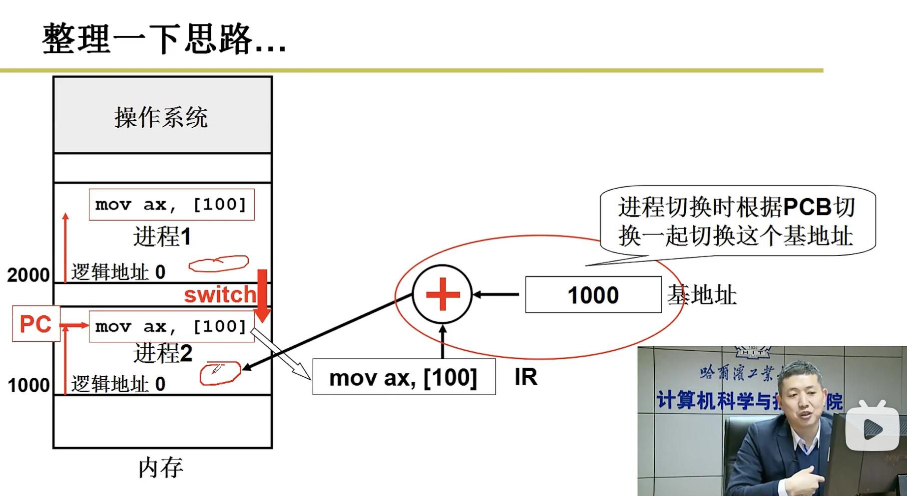
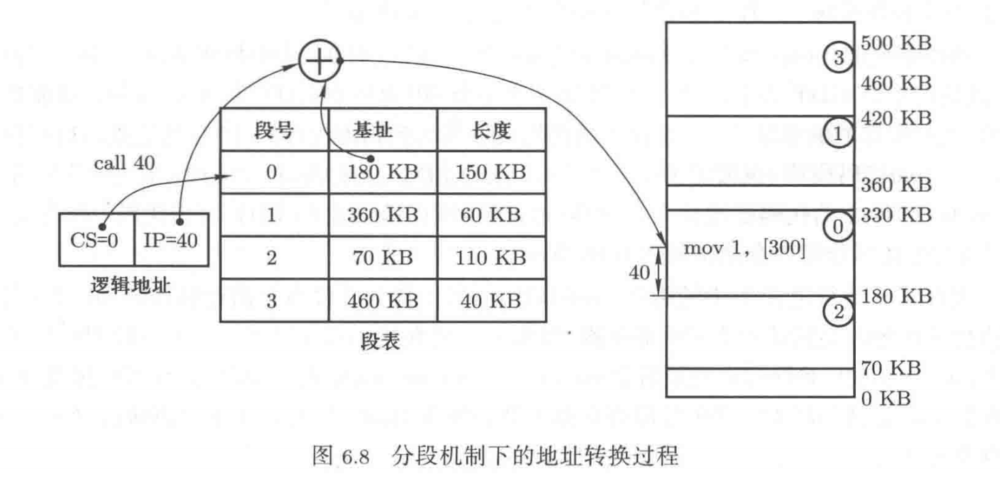
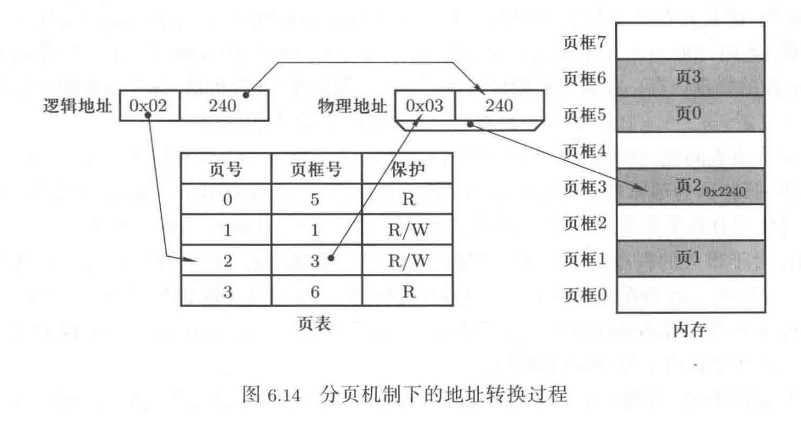
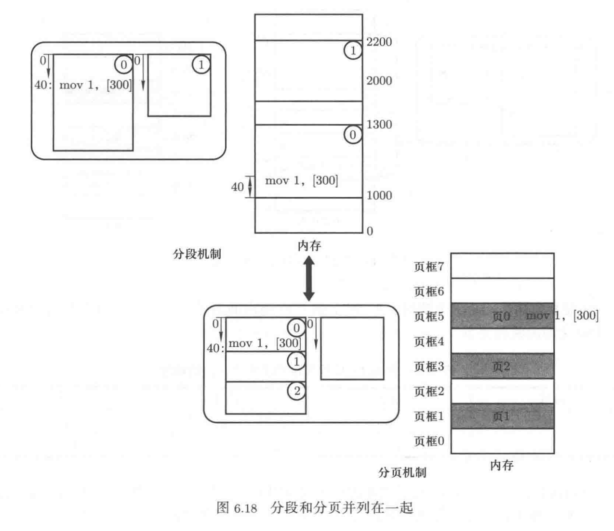
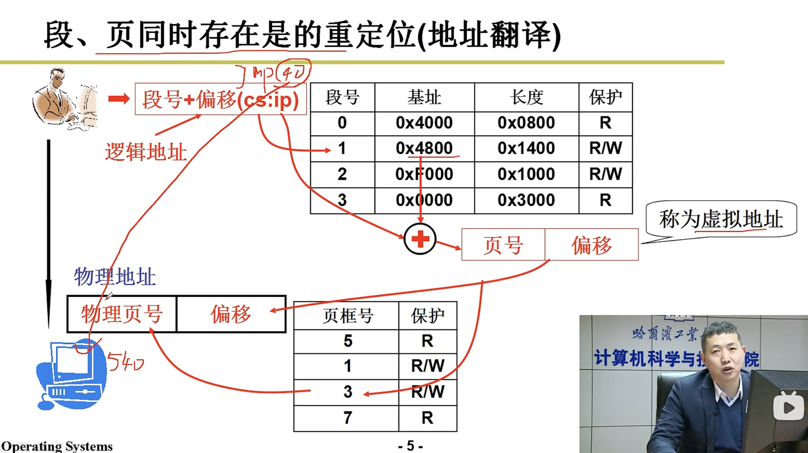
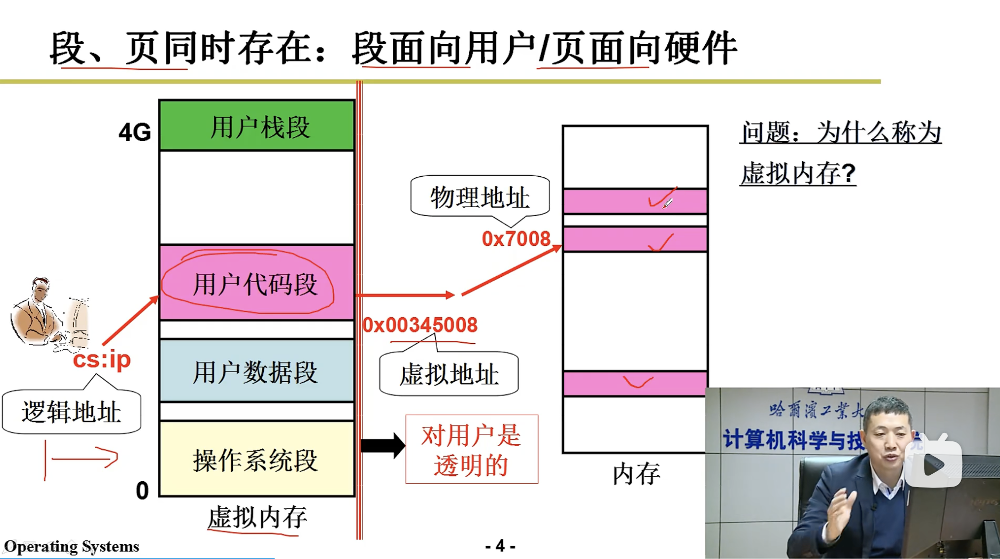
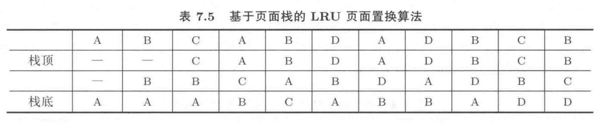
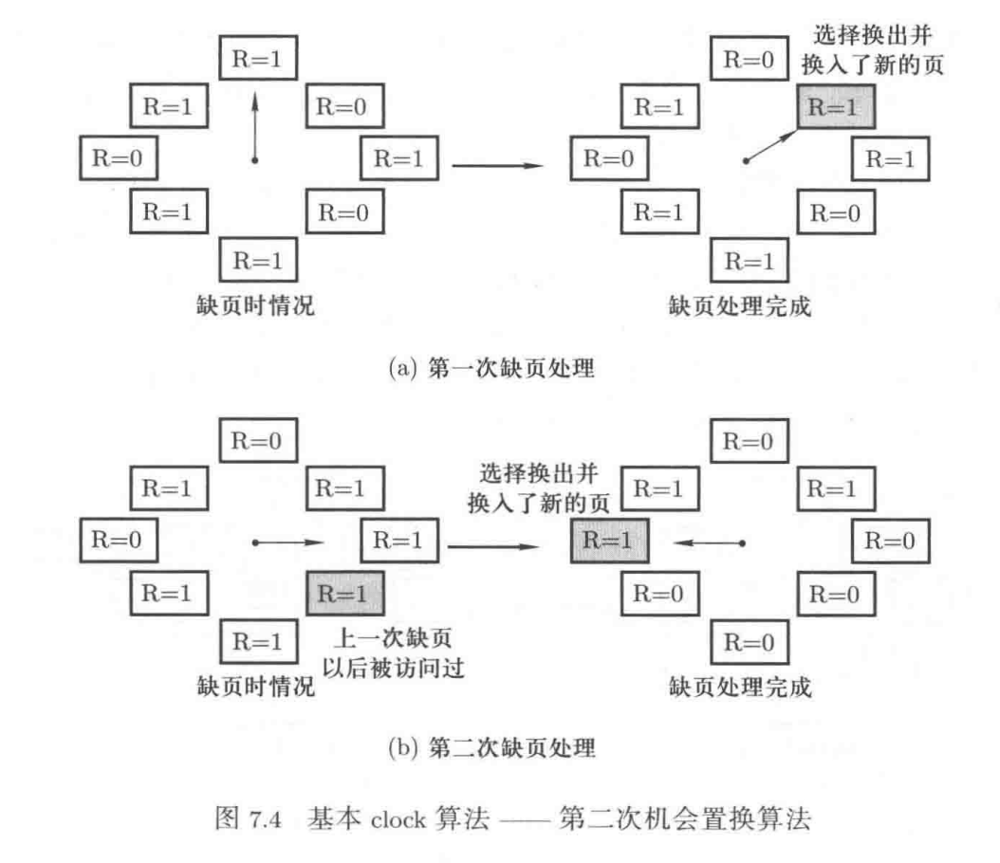
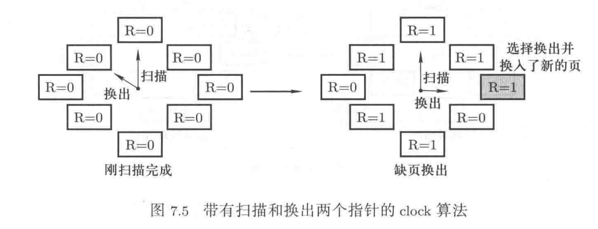

## 第三章 内存管理

### 程序重定位

在编译形成可执行程序时，用到的地址都是从0开始的相对地址，也被称为**逻辑地址**。但被加载到内存后可能使用任意一块空闲地址，所以需要将逻辑地址转化成内存中实际的物理地址，即**重定位**。

有以下几种解决方法：

1. 编译时重定位：需要在编译时确定哪块内存空间空闲，且在装入前不允许使用（用于执行固定任务的计算机系统，如嵌入式系统）

2. 载入时重定位：在程序载入时，根据初始内存地址修改程序里的逻辑地址，但如果进程阻塞换出内存后换入是的地址不一定是之前的地址，造成错误

3. **运行时重定位（PC机使用）**：在指令执行时才将逻辑地址转化为物理地址，取出指令—修改地址（**存储管理部件MMU**计算）—执行指令

   基地址存在PCB中，在内存基地址修改时更新，在执行时加载到寄存器中使MMU修改地址

   

### 分段

程序由若干段组成，每段都有各自的用途

- 代码段：程序指令形成的段，只读
- 数据段：存放存放程序使用的数据，可读可写
- 栈：实现函数调用，通常只能向下（高地址）增长
- 函数库：include的函数库，可有可无

由于各个段有不同的语义及限制操作，所以需要进行区分。

因为程序已经分段，故不需要将其整体放入内存的连续空间，可一段段放入不同的内存空间，提高内存使用效率

在进行重定位时，访问**段表（局部描述符表LDT，PCB中）**中对应段的基地址给MMU运算得到物理地址



分段的缺点是由于段较大，经过多次的申请和释放，很容易产生很多细小的无法分配给其他进程的**内存碎片**，故引入基于物理地址的分页机制（区别于给予逻辑地址分段机制）

### 分页

分页机制首先将内存分为大小相等的页框（通常为4B），然后再把请求放入内存的数据切成大小相同的页，最后将所有页映射到页框上。**以解决内存碎片问题造成的空间浪费。**

**页表存在PCB中**



在32位机上最大的逻辑地址为2^32，每个页面4K，所以有2^20页，每个页表项需要4B存储，故每个进程需要4MB在存储页表（每个进程都有自己的页表），当进程数多时，需要很大的空间存储页表，但实际上页表只是做了索引保存基地址的作用，没有实际作用，这代价不可接受。

但是由于程序的**局部性原则**，不需要把程序的所有页加载到内存中，可以去除未被使用的逻辑页，**缩小页表**。

可是这又引发了其他问题，由于删除了未使用项导致页表无法随机访问，需要通过多次查找页表获取页号对应的页框号。**每次访问页表就是访问内存，效率很低。**所以引入了**多级页表**，且保证**页表项连续**，可以随机访问，减少搜索（访存）次数，另外**只在内存中存需要一级页表对应的页表项**，提升内存利用率。


由于程序的**局部性原则**，访问的页集中，所以可以将近期使用的页信息放在**快表（TLB，Cache中）**，减少访存次数。

TLB内页表项无序。


### 段页式内存管理

从程序员角度，程序分为一个个逻辑段，但分段的缺点是由于段较大，在申请和释放时很容易产生内存碎片

从内存角度，程序分为一个个小的长度均匀的物理页存放到内存中，优点是提高了内存的利用率，但是有违程序员对于程序的理解

所以引入**段页式内存管理**方式，先将程序分段，再将程序分页，存储到物理内存上



当**磁盘上的一个程序要放入内存**时，会依次完成如下工作：

1. 在**虚拟内存分割分区，放入各个“段”**，不是真的放入，而是建立映射关系（fork出的子进程和父进程用不同的虚拟内存）
2. **建立段表**记录**逻辑地址和虚拟地址的映射**关系
3. 将**虚拟内存分割成页，放入空闲物理内存**
4. 建立页表记录**逻辑地址和物理地址的映射**关系（fork出的子进程拷贝父进程的映射关系，但如果子进程要修改数据区，则申请新内存页，建立映射关系，内核已将父进程的内存空间设为只读，防止了子进程的修改，所以子进程对于数据区的修改不会影响父进程）



虚拟地址对用户透明，用户无法获取物理地址



### 页的换入和换出

虚拟内存就是操作系统给进程提供的一个规整的、总长度总为4GB（32位操作系统）的地址空间，但实际的物理内存可能少于4GB，所以虚拟内存不可能全部映射到物理内存上，需要物理内存和磁盘存储的**换入/换出操作**。

通过虚拟内存和页表**确认页表项**，看其有效位是否为1（0表示在物理内存中，1表示不在），若为0，则需从磁盘**换入**。换入的系统调用（缺页中断）如下。

```c
// Step 0: push variable to stack
void do_no_page(unsigned long error_code, unsigned long address)
{
  address &= 0xfffff00; // Step 1: get page numuber
  page = get_free_page(); // Step2: malloc free page on physical memory
  bread_page(page,current->executable->i_dev, nr); //Step3: copy block to physical memory
  put_page(page, address); //Step4: update page table
}
```

如果物理内存满在`Step 2`直接分配内存会失败，需要选取页面**换出**

 #### 页面置换算法

1. LRU（最近最少使用）

基于页面栈（数据结构采用链表），搜索新页面是否在栈中，若不在则pop栈底元素，新元素入栈。如果在，则将栈顶元素修改为当前元素，其他元素下移



**操作系统不采用，因为每次页面访问都需要维护页面栈，也就是访存，另外还涉及到指针的修改**

2. clock算法（SCR算法，second-chance-replacement）

**clock算法是对于LRU的近似，LRU为最近最少使用，clock为最近的上次缺页以来不使用**

页面每次访问时R位置1，缺页时扫描当前线性表

- 如果R=1，置为0，不换出给它一次机会
- 如果R=0，换出，并将换入页R置为1



**存在的问题是实际发生缺页的概率并不大，可能找不出R=0的页，所以引入改近clock算法**

3. 改进的clock算法

需要一个指针定期扫描所有页并将对应R置0，换出页遇到R=0换出



