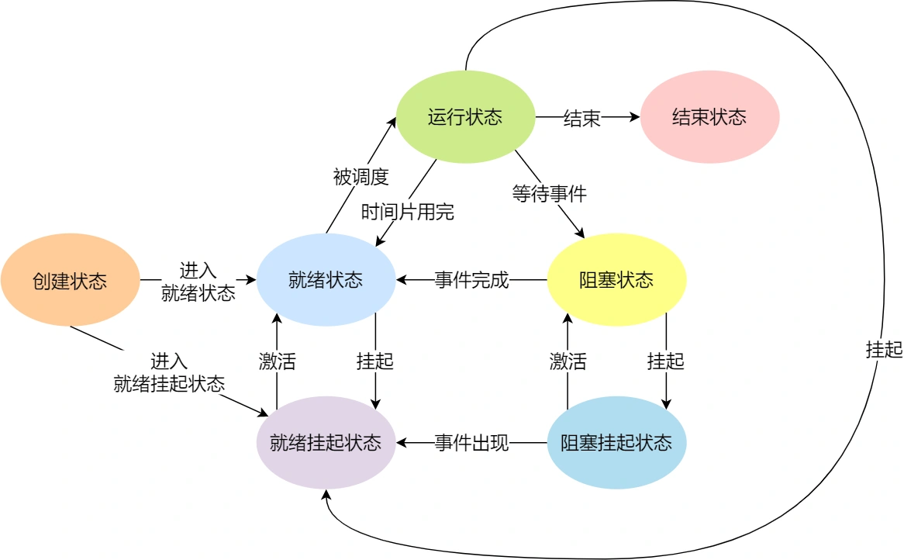
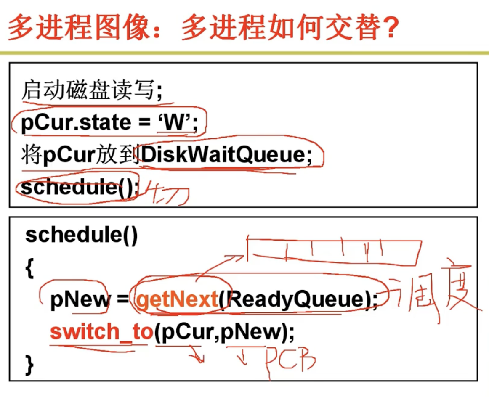
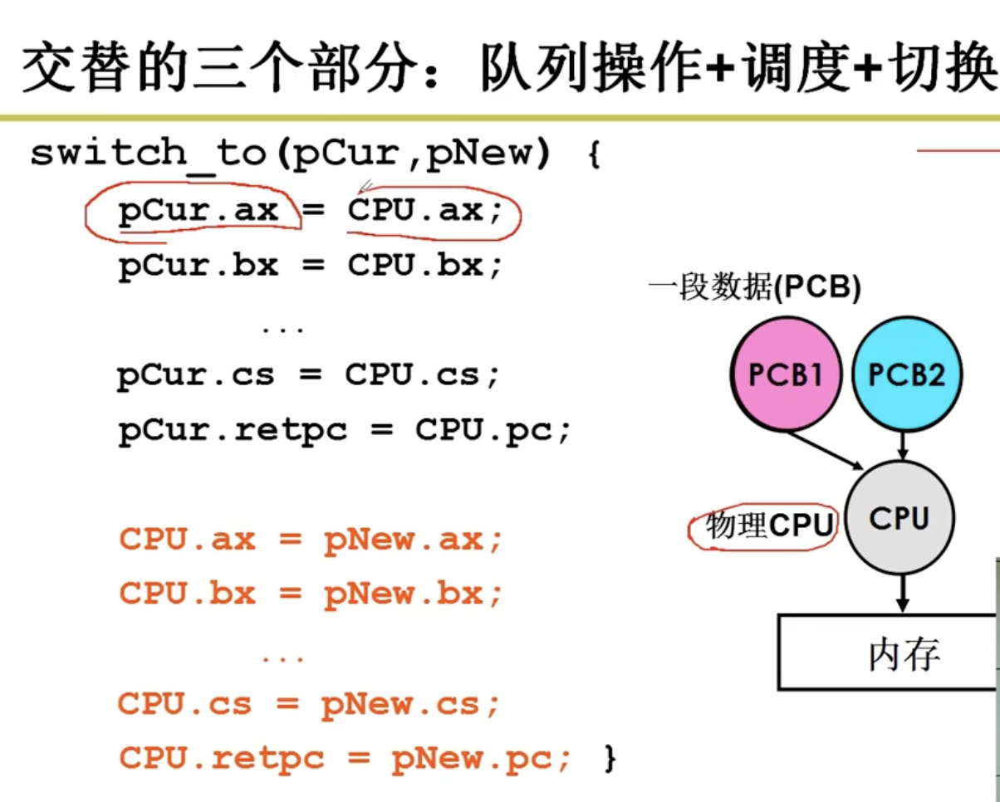
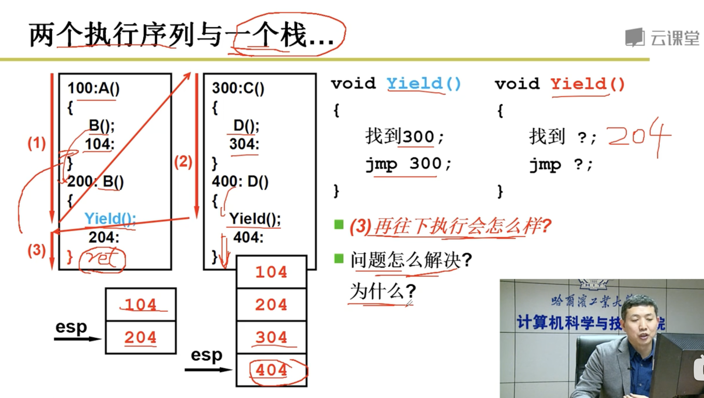
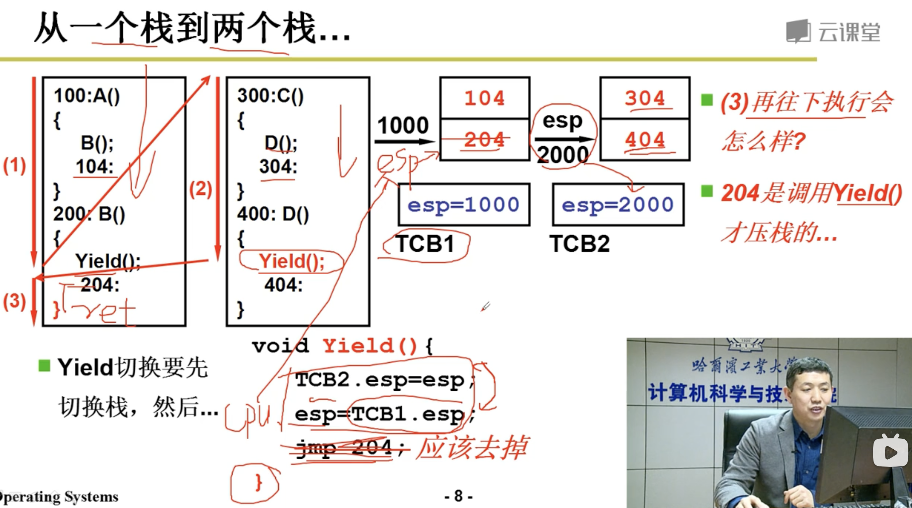
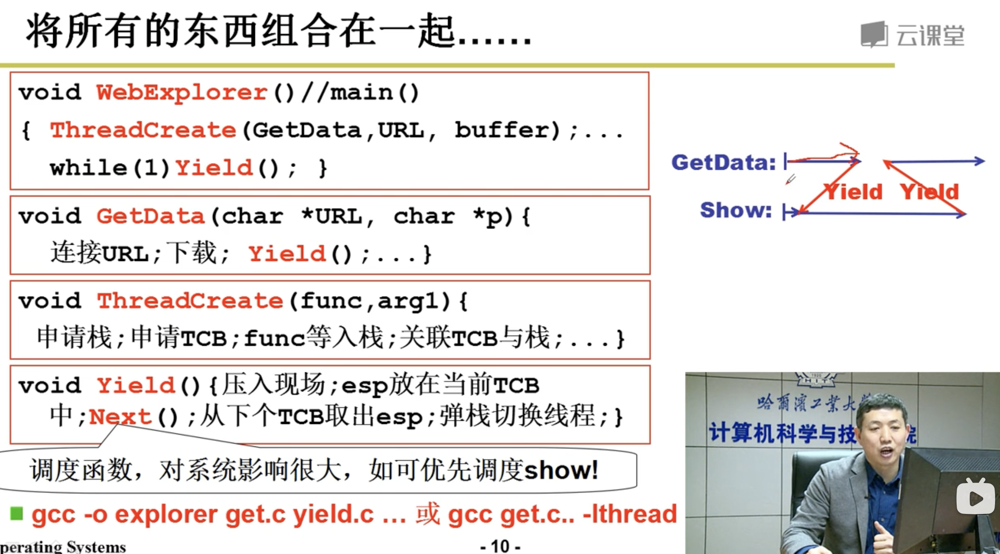
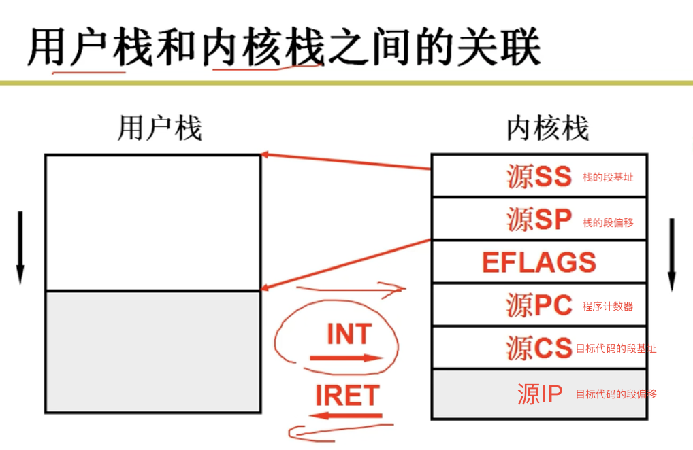
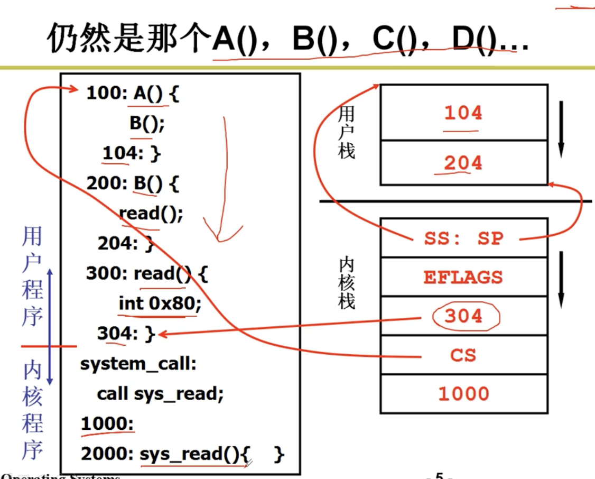
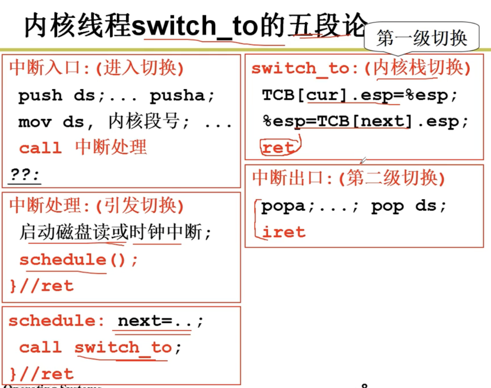

## 第二章 进程管理（如何实现多进程）

### 进程

运行中的程序（区别于未运行的静态程序），需要有数据结构保存当前运行的信息（PCB），便于切换不同进程

#### 进程的状态

#### 进程的切换

操作系统切换进程（宏观）

例子为进程运行到磁盘读写操作后与其他进程的切换

操作系统切换进程的PCB（微观）

##### PCB

PCB的结构

- **Process scheduling state** – The state of the process in terms of "ready", "suspended", etc., and other scheduling information as well, such as priority value, the amount of time elapsed since the process gained control of the CPU or since it was suspended. Also, in case of a suspended process, event identification data must be recorded for the event the process is waiting for;
- **Process structuring information** – the process's children id's, or the id's of other processes related to the current one in some functional way, which may be represented as a queue, a ring or other data structures;
- **Interprocess communication information** – flags, signals and messages associated with the communication among independent processes;
- **Process Privileges** – allowed/disallowed access to system resources;
- **Process State** – new, ready, running, waiting, dead;
- **Process Number (PID)** – unique identification number for each process (also known as Process ID);
- **Program Counter (PC)** – a pointer to the address of the next instruction to be executed for this process;
- **CPU Registers** – register set where process needs to be stored for execution for running state;
- **CPU Scheduling Information** – information scheduling CPU time;
- **Memory Management Information** – page table, memory limits, segment table;
- **Accounting Information** – amount of CPU used for process execution, time limits, execution ID etc.;
- **I/O Status Information** – list of I/O devices allocated to the process.

### 线程

将资源和指令执行分开，进程为资源+指令执行序列。

**线程几乎不拥有资源（通过共享进程的资源），只实现指令的切换（切换PC指针，寄存器等）**，保留了并发的优点，避免了进程切换的代价（保留现场，切换PCB）

**当需要并发而且共享相同资源（内存）时使用多线程编程**，进程间资源相互独立

#### 用户级线程

**只有用户级线程没有用户级进程，因为进程拥有内存资源，需要到内核态执行**

如果对于多线程使用同一个栈，则在return访问栈时会跳转到其他线程，所以应对于不同的线程使用不同的栈

yield：当前线程会尽量让出CPU资源来给其他线程执行

每个线程使用不同栈，通过不同的栈顶指针区分，yield更新当前线程TCB的栈顶指针，切换到下个线程的TCB，取栈顶指针

操作系统无法看到用户级线程，进而无法分配硬件多核处理，只有通过内核级线程调用多核

#### 内核级线程

有几个内核级线程就要有几套栈（每套包括用户态执行函数调用的栈，内核态执行函数调用的栈）

内核级线程切换步骤

### CPU调度策略

#### 任务调度策略的三个基本准则

- 任务周转时间：从新建到完成的时间
- 任务响应时间：从交互操作到任务响应的时间（前台任务关心）
- 系统吞吐量：一段时间内系统能完成的任务数

#### 调度算法

1. 先来先服务
2. 短作业优先调度：可抢占，平均周转时间短（作业运行时间只能近似给出）
3. 轮转调度：保证响应时间
4. 多级队列调度：两个任务队列，一个是采用轮转调度的前台任务，一个是采用短作业优先的后台任务
5. 多级反馈队列调度：动态调整任务类型（近期多IO可能为前台任务，无IO时间片结束未完成可能为后台大任务）

### 补充知识

#### 多处理器和多核

多处理器：多套CPU，Cache，MMU（内存映射表）资源

多核：多个CPU，共用Cache和MMU

