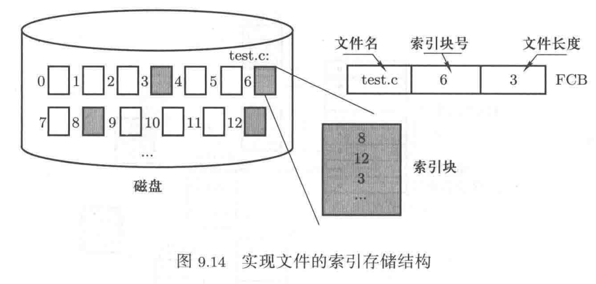
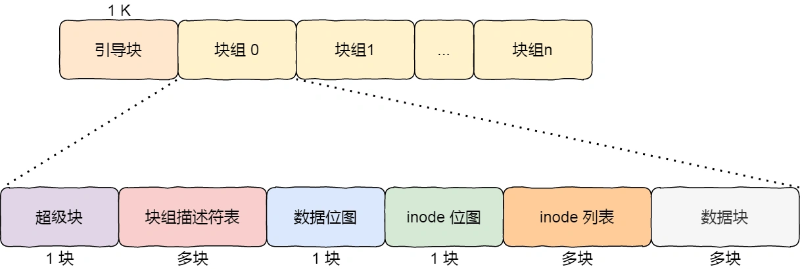

### 第四章 文件管理

#### 磁盘的工作原理

##### 磁盘读写的过程

1. 磁盘移动，找到要读的**柱面**（cylinder，简称C）
2. 从柱面选择具体读哪个**磁道**（magnetic head，简称H），选择对应的磁头上电（每次只能有一个磁头上电）
3. 旋转磁盘，将对应磁道中要读写的那个**扇区**（sector，简称S）转到磁头下方
4. 开始读写，将扇区中的内容读到内存缓存区中，或者将内存缓存区中的内容写到该扇区中


#### 生磁盘的使用

##### 第一层抽象：从扇区到磁盘块请求（抽象读写请求）

正常寻址需要通过**CHS**三维向量，但是可以通过一位扇区编号编址

磁盘读写时间 = 寻道时间（选择柱面）+旋转时间（选择+读取扇区）+传输时间（磁生电活电生磁）

其中寻道时间占主导，故每次只读/写一个扇区是对于时间的浪费，故一次读/写多个扇区，称为**块**

##### 第二层抽象：多个进程产生的磁盘请求队列（抽象读写方法）

**电梯调度算法**（CSCAN），磁头向一个方向运动，运动到提交访问的边界后复位，循环往复（复位防止内/外部块容易回复请求）


##### 第三层抽象：从磁盘请求到高速缓存（优化磁盘读写次数）

**读缓冲**：由于**局部性原理**，用户可能要在短时间内连续请求磁盘块中的相邻内容，所以操作系统一次读取一个/多个磁盘块到**磁盘高速缓存**

通过盘块号查看是否在磁盘高速缓存中，在则直接返回，不在则访问磁盘


**写缓冲**：通过延迟写入节省IO次数

**如果需要立即写会防止写入前系统崩溃可以使用fsync系统调用，除了文件调用外如果目录也是新创建的，需要目录也调用（目录也是文件）**

#### 基于文件的磁盘使用

##### 第四层抽象：引出文件（用户的文件视图）

存储结构

1. 顺序存储：不便于动态增长

2. 链式存储：无法随机访问

   隐式链接存储

   缺点：稳定性较差，系统在运行过程中由于软件或者硬件错误**导致链表中的指针丢失或损坏，会导致文件数据的丢失。**

   显式链接存储

   它指把用于链接文件各数据块的指针，显式地存放在内存的一张链接表中，该表在整个磁盘仅设置一张，每个表项中存放链接指针，指向下一个数据块号。内存中的这样一个表格称为**文件分配表（File Allocation Table，FAT）**。

   

3. 索引存储：通过索引块记录文件包含的所有块，可以随机访问

   

**Unix系统中的文件存储（多级索引）**


它是根据文件的大小，存放的方式会有所变化：

- 如果存放文件所需的数据块小于 10 块，则采用直接查找的方式；
- 如果存放文件所需的数据块超过 10 块，则采用一级间接索引方式；
- 如果前面两种方式都不够存放大文件，则采用二级间接索引方式；
- 如果二级间接索引也不够存放大文件，这采用三级间接索引方式；

那么，文件头（*Inode*）就需要包含 13 个指针：

- 10 个指向数据块的指针；
- 第 11 个指向索引块的指针；
- 第 12 个指向二级索引块的指针；
- 第 13 个指向三级索引块的指针；

所以，这种方式能很灵活地支持小文件和大文件的存放：

- 对于小文件使用直接查找的方式可减少索引数据块的开销；
- 对于大文件则以多级索引的方式来支持，所以大文件在访问数据块时需要大量查询

#### 文件系统使用

##### cat的系统调用

每个文件在read时都会返回一个非负整型**文件描述符（file descriptor）**

```shell
martin > strace cat test  # strace is a tool to print system call
													# hello in test
...
openat(AT_FDCWD, "test", O_RDONLY)      = 3   # open file, return file descriptor
newfstatat(3, "", {st_mode=S_IFREG|0644, st_size=6, ...}, AT_EMPTY_PATH) = 0
fadvise64(3, 0, 0, POSIX_FADV_SEQUENTIAL) = 0
mmap(NULL, 139264, PROT_READ|PROT_WRITE, MAP_PRIVATE|MAP_ANONYMOUS, -1, 0) = 0xffff9e49e000
read(3, "hello\n", 131072)              = 6 # read first block to a read buffer, return size of string
write(1, "hello\n", 6hello	# write hello to stdout
)                  = 6
read(3, "", 131072)                     = 0 # read next block
munmap(0xffff9e49e000, 139264)          = 0
close(3)                                = 0 # close test
close(1)                                = 0	# close stdout
close(2)                                = 0	# close stderr
exit_group(0)                           = ?
```

操作系统为**每个进程维护一个打开文件表**，文件表里的每一项代表文件描述符。

操作系统在打开文件表中维护着打开文件的状态和信息：

- 文件指针：系统跟踪上次读写位置作为当前文件位置指针，这种指针对打开文件的某个进程来说是唯一的；
- 文件打开计数器：文件关闭时，操作系统必须重用其打开文件表条目，否则表内空间不够用。因为多个进程可能打开同一个文件，所以系统在删除打开文件条目之前，必须等待最后一个进程关闭文件，该计数器跟踪打开和关闭的数量，当该计数为 0 时，系统关闭文件，删除该条目；
- 文件磁盘位置：绝大多数文件操作都要求系统修改文件数据，该信息保存在内存中，以免每个操作都从磁盘中读取；
- 访问权限：每个进程打开文件都需要有一个访问模式（创建、只读、读写、添加等），该信息保存在进程的打开文件表中，以便操作系统能允许或拒绝之后的 I/O 请求

##### 硬链接与软链接

有时候我们希望给某个文件取个别名，那么在 Linux 中可以通过**硬链接（Hard Link）** 和**软链接（Symbolic Link）** 的方式来实现，它们都是比较特殊的文件，但是实现方式也是不相同的。

硬链接是**多个目录项中的「索引节点」指向一个文件**，也就是指向同一个 inode，但是 inode 是不可能跨越文件系统的，每个文件系统都有各自的 inode 数据结构和列表，所以**硬链接是不可用于跨文件系统的**。由于多个目录项都是指向一个 inode，那么**只有删除文件的所有硬链接以及源文件时，系统才会彻底删除该文件。**


软链接相当于重新创建一个文件，这个文件有**独立的 inode**，但是这个**文件的内容是另外一个文件的路径**，所以访问软链接的时候，实际上相当于访问到了另外一个文件，所以**软链接是可以跨文件系统的**，甚至**目标文件被删除了，链接文件还是在的，只不过指向的文件找不到了而已。**


#### 文件系统实现

##### 基本结构



最前面的第一个块是**引导块**，在系统启动时用于启用引导，接着后面就是一个一个连续的块组了，块组的内容如下：

- **超级块**，包含的是文件系统的重要信息，比如 inode 总个数、块总个数、每个块组的 inode 个数、每个块组的块个数等等。
- **块组描述符**，包含文件系统中各个块组的状态，比如块组中空闲块和 inode 的数目等，每个块组都包含了文件系统中「所有块组的组描述符信息」。
- **数据位图和 inode 位图**， 用于表示对应的数据块或 inode 是空闲的，还是被使用中。
- **inode 列表**，包含了块组中所有的 inode，inode 用于保存文件系统中与各个文件和目录相关的所有元数据。
- **数据块**，包含文件的有用数据。**基本文件类型inode指向的数据块存储的是文件内容，目录类型inode指向的数据块存储的是该目录下文件和目录的inode**。

##### inode

**一个inode唯一对应一个文件或目录**

inode包含所有关于文件的信息，包括

- i_number：inode的id

- 文件类型（常规文件，目录等）
- 分配给它的块数
- 保护信息（谁拥有该文件以及谁可以访问它）
- 时间信息（创建，修改，上次访问的时间）
- 所有对应数据块的位置信息

##### 目录的读取

例如访问/usr/test.c

1. 找到根目录的inode，**在类UNIX系统中根目录的i_number为2**
2. **读取i_number为2的inode**，访问指向的数据块，**获取下级目录的inode**
3. **根据inode访问对应数据块**


##### 磁盘的写入

如果文件未被创建

1. 查询数据块位图查找空闲块，设置inode
2. 读取inode位图，查找空闲位图块
3. 写入inode位图
4. 写入inode
5. 创建当前目录inode和数据块，查找上级目录数据块更新当前目录inode

如果已被创建

1. 读取数据位图，查询空闲块
2. 写入数据位图
3. 更新当前文件的inode

**对象存储、块存储和文件存储**

对象存储、块存储和文件存储是三种不同的数据存储方式。它们各有特点和适用场景，下面分别介绍它们的定义和区别：

1. 对象存储

对象存储是一种存储数据的方式，**它将数据分为对象，每个对象有一个唯一的标识符（ID）**。对象存储系统通常是由多个分布式存储节点构成，每个节点都能够存储和访问对象。对象存储通常用于存储大规模的非结构化数据，如图片、视频、音频、日志等。相比于传统的文件存储方式，对象存储更适合于分布式环境下的数据存储和管理，具有高可扩展性、高可靠性和高可用性等特点。

2. 块存储

块存储是一种以块为单位的存储方式，将数据分为固定大小的块，并按块来读取和写入数据。块存储通常用于存储结构化数据，如数据库中的数据。块存储系统通常由存储设备（如硬盘、固态硬盘等）和控制器组成，存储设备负责存储数据块，控制器负责管理块的分配和释放。相比于对象存储和文件存储方式，块存储具有更快的数据读写速度和更高的并发性能，但它需要应用程序自己管理数据的组织方式和存储位置等。**文件系统在客户端**

3. 文件存储

文件存储是一种将数据组织成文件的存储方式，每个文件有一个唯一的文件名，并以文件为单位进行读写。文件存储通常用于存储应用程序的配置文件、日志文件、文本文件等，它具有简单易用、易于管理的特点。相比于对象存储和块存储，文件存储方式更适合于存储小型的结构化和非结构化数据，但它对文件数量的管理和文件系统的维护可能需要更多的人力和资源。**文件系统在存储端，便于共享，如NAS**


