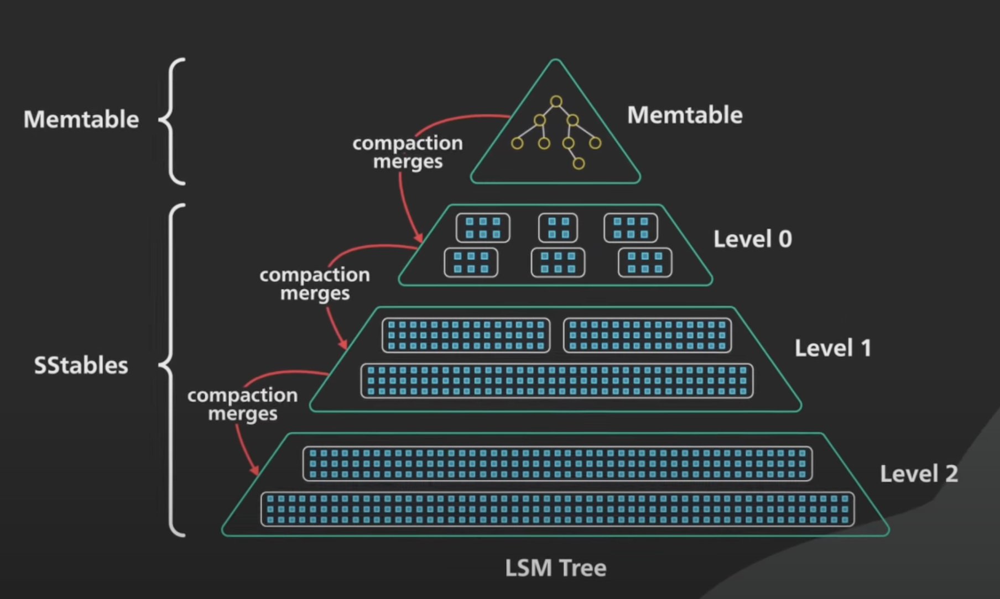

### 第四章 文件管理（数据库底层存储）

#### LSM Tree

在内存中维护一个Memtable并排序（AVL，红黑树等），当达到某一阈值后写入到磁盘，写入的结构称为SSTable

SSTable会定期进行压缩compaction，将重复的key以最新value压缩。由于数据量较大，所以通过数据大小对SStable分层

**读：**从Memtable到各级SStable读取，由于SStable有序，可以通过范围判断是否在当前table，然后通过二分查找等方法查找

**写：**直接增加到Memtable

**优化：**布隆过滤器，通过哈希方法计算key是否存在，否表示肯定不存在，是表示可能存在

**优点：**顺序写；写效率高

**缺点：**读效率过低

#### B+ Tree

**B树和B+树的区别**

- B树的每个节点都存储了key和data，而B+树的**data存储在叶子节点上**。
- B+树非叶子节点仅存储key不存储data，这样**一个节点就可以存储更多的key**。可以使得B+树相对B树来说更矮（IO次数就是树的高度），所以**与磁盘交换的IO操作次数更少**。
- B+树所有叶子节点构成一个有序链表，按主键排序来遍历全部记录，能**更好支持范围查找**。
  由于数据顺序排列并且相连，所以便于区间查找和搜索。而B树则需要进行每一层的递归遍历，相邻的元素可能在内存中不相邻，所以缓存命中性没有B+树好。
- B+树所有的查询都要从根节点查找到叶子节点，**查询性能更稳定**；而B树，每个节点都可能查找到数据，需要在叶子节点和内部节点不停的往返移动，所以不稳定。

#### B tree对比LSM tree

| 存储引擎 | B-Tree                                                | LSM-Tree                                                     | 备注                                                         |
| -------- | ----------------------------------------------------- | ------------------------------------------------------------ | ------------------------------------------------------------ |
| 优势     | 读取更快                                              | 写入更快                                                     |                                                              |
| 写放大   | 1. 数据和 WAL 2. 更改数据时多次覆盖整个 Page          | 1. 数据和 WAL 2. Compaction                                  | SSD 不能过多擦除。因此 SSD 内部的固件中也多用日志结构来减少随机小写。 |
| 写吞吐   | 相对较低： 1. 大量随机写。                            | 相对较高： 1. 较低的写放大（取决于数据和配置） 2. 顺序写入。 3. 更为紧凑。 |                                                              |
| 压缩率   | 1. 存在较多内部碎片。                                 | 1. 更加紧凑，没有内部碎片。 2. 压缩潜力更大（共享前缀）。    | 但紧缩不及时会造成 LSM-Tree 存在很多垃圾                     |
| 后台流量 | 1. 更稳定可预测，不会受后台 compaction 突发流量影响。 | 1. 写吞吐过高，compaction 跟不上，会进一步加重读放大。 2. 由于外存总带宽有限，compaction 会影响读写吞吐。 3. 随着数据越来越多，compaction 对正常写影响越来越大。 | RocksDB 写入太过快会引起 write stall，即限制写入，以期尽快 compaction 将数据下沉。 |
| 存储放大 | 1. 有些 Page 没有用满                                 | 1. 同一个 Key 存多遍                                         |                                                              |
| 并发控制 | 1. 同一个 Key 只存在一个地方 2. 树结构容易加范围锁。  | 同一个 Key 会存多遍，一般使用 MVCC 进行控制。                |                                                              |

#### 数据库索引

优点：

- 优化了select速度
- 减少磁盘IO

缺点：

- 对于非聚簇索引，需要额外的磁盘空间

- 增删改需要更新索引